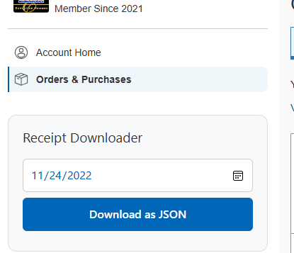
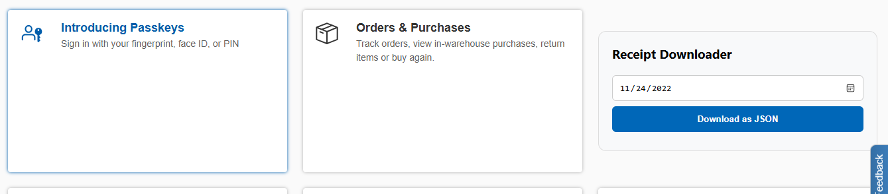
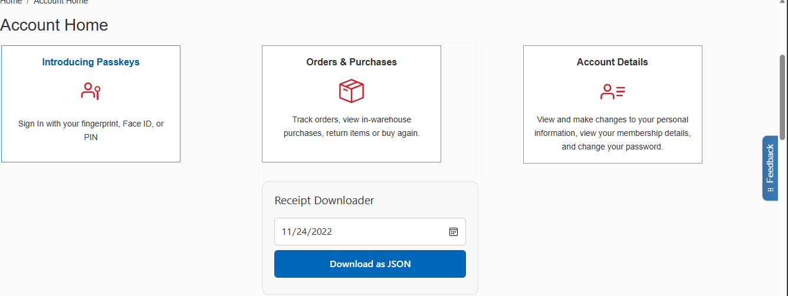

# Costco Receipt Downloader

A browser extension that allows you to download all your Costco warehouse receipts as a JSON file directly from the Costco Order Status page.


## Features

- 📅 **Custom Date Range** - Select any start date to download receipts from
- 💾 **One-Click Download** - Simple interface to download all receipts as JSON
- 🔄 **Remembers Settings** - Your date preference is saved automatically
- 📊 **Complete Data** - Downloads all receipt details including items, taxes, tenders, and coupons
- 🌐 **Cross-Browser** - Works with both Firefox and Chrome
- 🎨 **Clean UI** - Minimal, unobtrusive interface

## Screenshots

The extension adds a small card interface to your Costco Order Status page:

  

## Installation

### Firefox

1. Download or clone this repository
2. Open Firefox and navigate to `about:debugging`
3. Click "This Firefox" in the left sidebar
4. Click "Load Temporary Add-on..."
5. Select the `manifest-firefox.json` file from the repository

### Chrome

1. Download or clone this repository
2. Open Chrome and navigate to `chrome://extensions/`
3. Enable "Developer mode" (toggle in top-right)
4. Click "Load unpacked"
5. Select the repository folder
6. Make sure you're using `manifest-chrome.json` (rename it to `manifest.json`)

## Usage

1. Navigate to your Costco Account Home page (any URL containing `accounthome`, such as):
   - https://www.costco.com/accounthome
   - Or click "Account" from the Costco homepage
2. Log in to your Costco account if needed
3. The extension interface will appear in the top-right corner
4. Select your desired start date (defaults to 3 years ago)
5. Click "Download Receipts"
6. Your receipts will be downloaded as `costco-[timestamp].json`

## File Structure

```
costco-receipt-downloader/
├── .github/
│   └── workflows/
│       └── build.yml           # GitHub Actions workflow
├── manifest-firefox.json       # Firefox manifest (Manifest V2)
├── manifest-chrome.json        # Chrome manifest (Manifest V3)
├── content.js                  # Main extension script
├── styles.css                  # CSS for script
├── package.json                # npm build scripts (optional)
├── README.md                   # This file
├── CONTRIBUTING.md             # Contribution guidelines
├── LICENSE                     # MIT License
└── .gitignore                  # Git ignore file
```

## Building/Packaging

You have several options to package the extension:

### Option 1: GitHub Actions (Automated - Recommended)

Every push to `main` or pull request automatically builds both versions:

1. Push your code to GitHub
2. Go to the "Actions" tab in your repository
3. Download the built extensions from the artifacts

**To create a release:**
```bash
git tag v1.0.0
git push origin v1.0.0
```
This will automatically create a GitHub release with both extension files attached.

This will create both Firefox and Chrome packages in the `dist/` folder.

### Option 3: Use npm Scripts

```bash
npm run build           # Build both versions
npm run build:firefox   # Build Firefox only
npm run build:chrome    # Build Chrome only
```

### Option 4: Manual Packaging

**Firefox:**
```bash
cp manifest-firefox.json manifest.json
zip -r costco-receipt-downloader-firefox.xpi manifest.json content.js
rm manifest.json
```

**Chrome:**
```bash
cp manifest-chrome.json manifest.json
zip -r costco-receipt-downloader-chrome.zip manifest.json content.js
rm manifest.json
```

## Data Format

The extension downloads receipts in JSON format with the following structure:

```json
[
  {
    "warehouseName": "Costco Wholesale",
    "transactionDate": "11/20/2025",
    "total": "123.45",
    "itemArray": [
      {
        "itemDescription01": "Product Name",
        "amount": "19.99",
        ...
      }
    ],
    "tenderArray": [...],
    "couponArray": [...],
    "subTaxes": {...}
  },
  ...
]
```

## Privacy & Security

- ✅ Only runs on Costco.com pages
- ✅ Uses your existing Costco authentication
- ✅ No data sent to external servers
- ✅ All processing happens locally in your browser
- ✅ No tracking or analytics

## How It Works

1. The extension injects a UI into the Costco Order Status page
2. When you click "Download Receipts", it queries Costco's GraphQL API
3. The API request uses your existing authentication tokens from localStorage
4. Receipt data is fetched and formatted as JSON
5. The file is downloaded directly to your browser's download folder


## Troubleshooting

### Button doesn't appear
- Ensure you're on the Costco Account Home page (URL should contain `accounthome`)
- Try refreshing the page
- Check that the extension is enabled in your browser
- Make sure you're logged in to your Costco account

### Download fails
- Make sure you're logged into your Costco account
- Check browser console for error messages
- Verify you have receipts in the selected date range

### No receipts downloaded
- Adjust the start date to cover a period when you made purchases
- Ensure your Costco membership is active

## Contributing

Contributions are welcome! Please feel free to submit a Pull Request.

1. Fork the repository
2. Create your feature branch (`git checkout -b feature/AmazingFeature`)
3. Commit your changes (`git commit -m 'Add some AmazingFeature'`)
4. Push to the branch (`git push origin feature/AmazingFeature`)
5. Open a Pull Request

## Known Limitations

- Only downloads warehouse receipts (in-store purchases)
- Requires active Costco membership and login
- Date range queries are limited by Costco's API
- Temporary installation only (not published to browser stores)

## Roadmap

- [ ] Add support for online order receipts
- [ ] Export to CSV format
- [ ] Receipt search and filter functionality
- [ ] Spending analytics dashboard
- [ ] Multi-language support

## License

This project is licensed under the MIT License - see the [LICENSE](LICENSE) file for details.

## Disclaimer

This is an unofficial extension and is not affiliated with, endorsed by, or connected to Costco Wholesale Corporation. Use at your own risk.

## Support

If you encounter any issues or have questions:
- Open an issue on GitHub
- Check existing issues for solutions
- Review the troubleshooting section above

## Acknowledgments

- Built for personal use and shared with the community
- Uses Costco's existing GraphQL API
- Inspired by the need for better receipt management

---

**Note**: This extension requires manual installation as it's not published on the Chrome Web Store or Firefox Add-ons marketplace.
